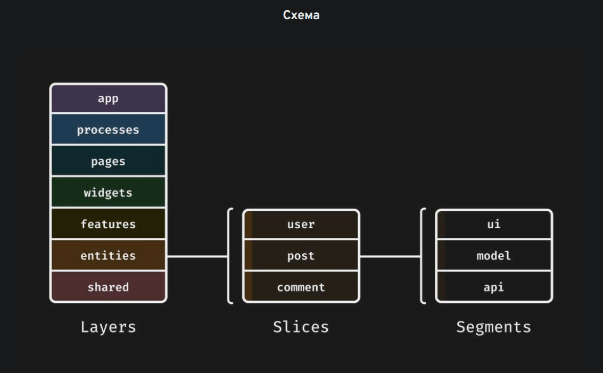
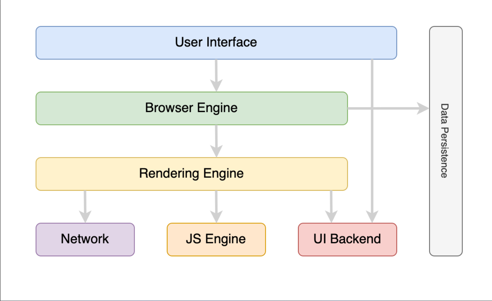

# FSD
Слои всегда импортируются снизу вверх.
1. app - здесь распологается входная точка приложения, обертки над этой входной точкой - провайдеры и т.д.
2. pages - здесь распологаются страницы приложения.
3. widgets - здесь распологаются самостоятельные блоки приложения - header, footer, sidebar и т.д.
4. features - здесь распологаются пользовательские сценарии - написать пост, поставить лайк.
5. enitites - здесь распологается бизнес логика - экшены, редюсеры, сторы.
6. shared - здесь распологается часто переиспользуемый код - ui компоненты, хелперы и т.д.

# mobx
Порядок обновления mobx:
1. event извне (клик мыши и т.д.) вызывает action;
2. action производит обновление наблюдаемых полей (иными словами, стейт приложения).
3. обновление стейта приложения приводит к перерасчету некоторых свойств стейта и side-эффектам(обычно они называются реакциями).
4. side-эффекты могут вызывать отдельные экшены.
  
Computed-свойства - это специальные свойства, которые возвращают высчитываемые значения на основе полей состояния.
  
Функция `autorun` - специальная функция, которая позволяет отслеживать изменения значения.  
Аргументом принимает функцию. `autorun` отслеживает только те поля, которые прописаны внутри тела переданной функции.
Реакции являются побочным эффектом изменения состояния, и никакого нового значения они не возвращают.  

HOC `observer` - это HOC, который подписывает react-компонент на изменения любых используемых в компоненте значений,
То есть, компонент перерендерится только в том случае, если произошли изменения определенных полей, используемых в компоненте.  
`observer` - это тот же `autorun`, в том понимании, что происходит реакция при изменении полей стейта, используемых внутри комопнента. Только реакцией является перерендер компонента.  

Факт чтения `autorun`-ом или `observer`-ом полей состояния отслеживает через Proxy.
Оборачивая объекты или примитивы в `observable` (наблюдаемое значение состояния) и т.д - создается proxy-объект, в котором переопределены getter и setter.  
Например, в фукнции `autorun` вызвано чтение состояния `count`, геттер `count` это заметит и построит граф зависимости между реакцией и состоянием.  
Если же значение `count` изменилось - вызывается сеттер и по построенной выше зависимости происходит вызов сайд-эффектов и перерасчетов computed-свойств. (происходит уведомление всех подписчиков).  
Mobx так же, как и реакт изменяет состояния через batch-апдейты.

Mobx может спокойно отследить, какой объект поменялся. В Mobx ВОЗМОЖНЫ МУТАЦИИ в отличии от Redux и RTK.
Mobx сравнивает объекты и в глубине. Он мутирует только тот объект, который изменился, а не весь условный массив объектов.

Computed-свойства могут подписываться на состояния из других сторов.

# Протоколы.
Протокол - это набор правил, определяющий принципы взаимодействия устройств в сети.
HTTP - прикладной протокол клиент-серверного взаимодействия. Лежит в основе обмена данных в Интернете.
Общение происходит сообщениями, где инициатором является клиент (веб-браузер).
Клиент отправляет сообщение (запрос - request), сервер же отвечает на эти сообщения своими сообщениями (ответ - response).
Между клиентом и сервером так же могут находиться различные прокси, которые занимаются кешированием некоторых результатов, фильтрацией и другим.
  
В осное HTTP лежит другой протокол - TCP.
TCP - это транспортный протокол. Он гарантирует доставку данных, а так же обеспечивает их целостность.
TCP отвечает за установление соединения, управлением потоком данных, исправление ошибок и упорядочивании пакетов.

В сферу влияния HTTP входит определние формата передачи данных - содержание веб-страниц, а так же запросы и ответы между сервером и клиентом.
HTTP определяет, как клиент запрашивает данные у сервера, и как сервер на них реагирует. HTTP описывает заголовки сообщения, методы (GET POST etc...) и другие аспекты взаимодействия.

# Браузер
Браузер состоит из:
1. `User Interface` - компонента отвечает за все, что видит пользователь: адресная строка, кнопки "вперед/назад", меню, закладки и т.д. Кроме области, где отображается сам сайт.
2. `Browser Engine` - компонента отвечает за взаимодействия между `Rendering Engine` и `User Interface`. То есть, дает команду для `Rendering Engine` от `User Interface`, если пользователь нажал на кнопку "назад", то отдается команда для `RE` отрисовать предыдущее состояние.
3. `Rendering Engine` - компонента отвечает за отображение веб-страниц. Он может парсить HTML/XML, CSS И PDF.
4. `Network` - компонента отвечает за сетевое взаимодействие. Выполняет запросы за ресурсами, в целом все общение браузера с интернетом происходит через эту комопоненту.
5. `JS Engine` - компонента, которая парсит и исполняет js-код.
6. `UI Backend` - компонента, которая отвечает за стандартные компоненты страниц - чекбоксы, инпуты, кнопки и т.д.
7. `Data Persistance` - компонента, которая отвечает за хранение данных в localStorage, sessionStorageb и т.д.

Как происходит процесс рендеринга страницы на экране?
В первую очередь происходит запрос в компоненте `Network` и в клиент приходит `html`-документ. Документ приходит чанками (по 8кб обычно).  
После процесс парсинга и рендеринга происходит в компоненте `Rendering Engine`.
Результат парсинга является уже `DOM(Document Object Model)-дерево`.
По мере нахождения ссылок на сторонние ресурсы внутри `html` - происходит запрос и к этим ресурсам.
`CSS` тоже парсится компонентом `Rendering Engine`, и преобразуется уже в `CSSOM (CSS Object Model)`.

После того, как мы получили `DOM` и `CSSOM` - они соединяются и мы получаем `Render Tree`.
`Render Tree` представляет собой древо *ВИДИМЫХ (!)* на странице элементов. Нужно понимать, что все элементы, имеющие display: none или другие отрицательно влияющие на отображения свойства не будут попадать вовсе в `Render Tree`.

Браузер строит `Render Tree` для того, чтобы определить в каком порядке и что ему отрисовывать.
Построение `Render Tree` начинается с рутового элемента (`html`), проходит по всем видимым элементам (пропуская `link`, `meta`, `script` и скрытые через `css` элементы).

После построения `Render Tree` браузер должен понять где и с какими размерами будет отображаться элемент. Этот процесс называется `Layout`.
`Layout` - это рекурсивный процесс определения положения и размеров элементов из `Render Tree`.
После расположения элементов на странице - можно начать отрисовывать эти компоненты. Этот процесс называется `Paint`.
После есть ещё перерасчеты и всякие анимации - этим уже занимается процесс `Composite`

1. Самый простой процесс для браузера это `Composite`, но он вызывается только двумя свойства - transform и opacity. Они являются двумя самыми дешевыми свойствами для анимации.
2. Дальше по сложности - процесс `Paint`. Он вызывается изменением свойства background и т.п. После `Paint` произойдет `Composite`
3. Далее - процесс `Layout`. Его триггерит изменение `display`. После `Layout` произойдет изменение `Paint`, а после него уже `Composite`